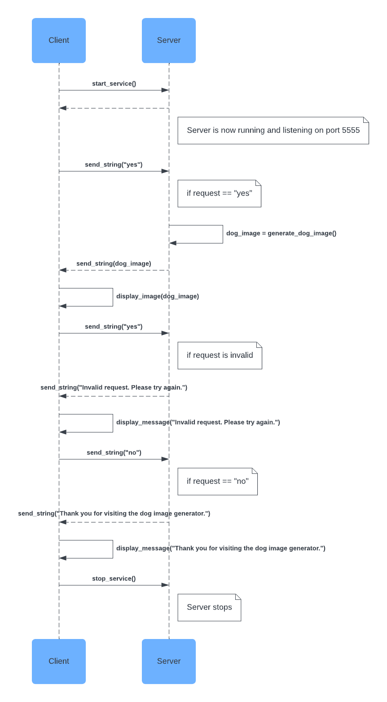

# Communication Contract: Image Generator Microservice 

The Image Generator microservice will generate a random image from a local datatset, this one will use a dataset from Kaggle, generating dog images. 

## Requirements

1. Have ZeroMQ installed; installed by using "pip install pyzmq" in terminal
2. Retrieve a dataset of images and place in folder titled "dataset" within same folder as python files (this will be included in the microservice files but can be easilt altered)
3. You will need to start with two terminals for the main file, and enter "python zq_response.py" in one and, "python zq_request.py" in the other

   
## The Request
* The client will send a string that states "Would you like to receive a dog image: (yes/no):" to the server
* A yes will push the server to respond with a dog image
* A no will push the server to resond with a thank you message

## The Response
* The response "Yes" will respond with a path to a dog image that can be loaded
* The reponse "No" will resopond with "Thank you for visiting the dog image generator."
* Any other response will respond with "Please enter yes or no."

## Example Call:
* Would you like to receive a dog image: (yes/no):
* Yes
* Received response: 'dataset\Bulldog_59.jpg'
* n
* Please enter yes or no.
* No
* Thank you for visiting the dog image generator.

## UML Sequence Diagram

